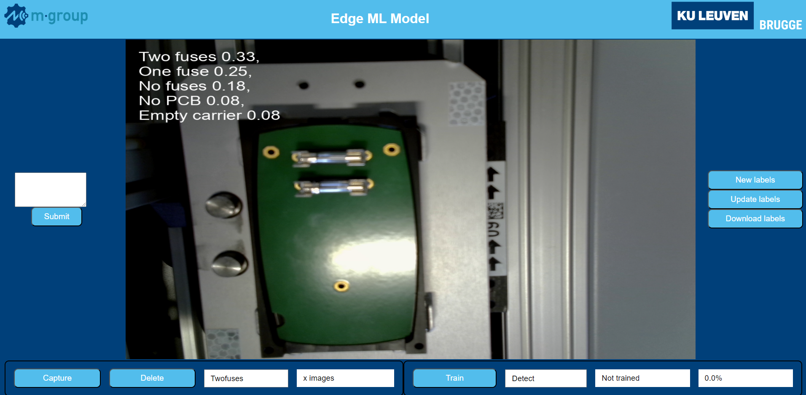

# Ultimate Factory Edge ML Demo



## Installation

Clone this repository to your local working directory.

```bash
git clone https://github.com/MatthiasDR96/uf_edge_ml_demo.git
```

Install all requirements.

```bash
pip install -r requirements.txt    
```

Or run the code in a Docker environment configured for the project using the .devcontainer extension of Visual Studio Code. 

## Usage

Run the main.py script. The webserver can be accessed via: hostname:8000. It can take a while before the stream starts. 

* Inference: When the webserver is started, images get captured and the inference results are directly shown on the captured frames. By default, there are three pretrained systems that can be selected for inference from the drop-down menu next to the training button. One can choose from classification, detection, and segmentation. 

* Data-collection: When one wants to train custom models, data needs to be captured. On the GUI, in the left plane, classes can be entered in the text field separated by "Enter". When clicking the submit button, image folders for each class will be created and are accessible via the drop-down menu. When clicking the capture button, images get stored in the image folder corresponding to the selected category. All image folders can also be deleted using the delete button. 

* Training: After the data collection, training can be started using the training button. The type of model to train can be selected from the drop-down menu. For classification, no extra labelling is required. All captured data is stored in folders with the corresponding class names. When clicking the training button, the classifier starts training. Once done, the new classifier inferences on the new images. For detection and segmentation, first some additional labelling is required. 

* Labelling: Once all images are stored in the correct folders, one can start labelling. Labelling is done via Label Studio that gets started when running the main.py script. You can login using 'ultimate.factory@kuleuven.be' with password 'Kuleuven8200' (This is only a virtual local account and is not shared online) Once done, pressing the 'New labels' button creates a new project with the correct classes in Label Studio and imports all images. When one wants to import some additional images, some new images can be captured and the 'Update labels' button will add them to Label Studio. In Label Studio, all images can be labelled using the userfriendly labelling tools. When done labelling, clicking the 'Download labels' button will download the labels locally. Once done, training can be started by pressing the train button. 